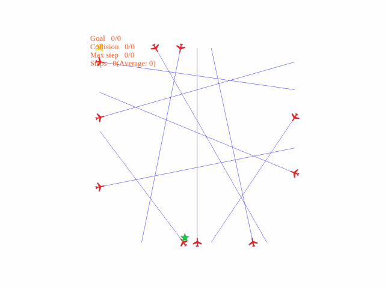

# Explainable and Safe Reinforcement Learning for Autonomous Air Mobility

## Introduction
It is the source code of **"Explainable and Safe Reinforcement Learning for Autonomous Air Mobility"**, which presents a novel deep reinforcement learning (DRL)
controller to aid conflict resolution for autonomous free flight. To study the safety under adversarial attacks, we additionally propose an adversarial attack strategy that can impose both safety-oriented and efficiency-oriented attacks.

## Requirements

* Python 3.8
* [PyTorch](http://pytorch.org/)

In order to install requirements, follow:

```bash
pip install -r requirements.txt
```
## Details

### Environment

The definition of environment is in `envs`: 

* `envs/SimpleATC_env` is for **traditional DQN** agent with global perception

* `envs/SimpleATC_env_v2` is for **safety-aware DQN(SafeDQN)** agent with global perception

* `envs/SimpleATC_env_flexible` is for **traditional DQN** agent with local perception

* `envs/SimpleATC_env_flexible_v2` is for **safety-aware DQN(SafeDQN)** agent with local perception

Parameter of the environments can be found in `envs/config.py`

### DQN Agents

You can train and evaluate a model in `agents`:

* `agents/dqn_simple_env` is for **traditional DQN** agent
* `agents/dqn_simple_env_v2` & `agents/dqn_simple_env_v2_X` are both for **safety-aware DQN(SafeDQN)** agent, while the latter is for **SafeDQN-X**, which only needs k-nearest neighbours' information for flexible airways

For training:
```bash
# take traditional DQN as an example
python dqn_simple_env.py --train=True --save_path=" "
```
You can find the DQN structure in `models/dqn_model`.
### Adversarial Attacks

## Demo
|                  |         Without Attack         |                     Uniform Attack                      |           Strategically-Timed Attack            |
|:----------------:|:------------------------------:|:-------------------------------------------------------:|:-----------------------------------------------:|
|    **DQN-10**    |       |                      |               |
|   **DQN-X10**    |      |                     |              |
|  **safeDQN-10**  |   |                  |           | 
| **safeDQN-X10**  |  |                 |          |


